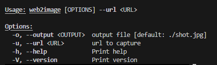

# web2image

## introduction

This is a cli tool for converting web pages to images and add a qrcode to the image.

## usage

## output example

## learn from [如何快速掌握新的 crates](https://www.bilibili.com/video/BV12K4y1X7qw/?share_source=copy_web&vd_source=5f1982e0be55875e72626a13b28d317d)
